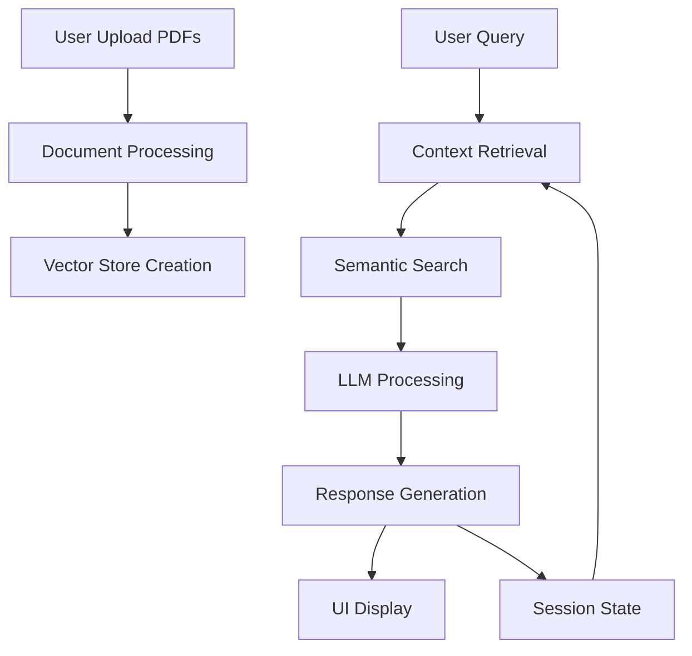

# Personlised Q&A bot using RAG

A sophisticated chatbot application that allows users to upload PDF documents and engage in natural conversations about their content using Google's Gemini Pro LLM. The system employs advanced document processing, semantic search, and conversational AI to provide accurate, context-aware responses.

## 🎯 Objective

The primary goal of this project is to create an intelligent document interaction system that:
- Enables users to upload multiple PDF documents
- Processes and indexes document content for efficient retrieval
- Provides a conversational interface for document-related queries
- Leverages state-of-the-art language models for accurate responses
- Maintains conversation context for more natural interactions

## 🛠️ Core Technologies

### 1. Language Models and AI
- **Google Gemini Pro**: Latest generation LLM for natural language understanding and generation
- **HuggingFace Embeddings**: all-MiniLM-L6-v2 model for generating document embeddings
- **LangChain**: Framework for building LLM applications
  - ConversationalRetrievalChain for managing conversation flow
  - ConversationBufferMemory for maintaining chat history

### 2. Vector Storage and Search
- **FAISS (Facebook AI Similarity Search)**:
  - In-memory vector database for efficient similarity search
  - Enables semantic search capabilities
  - Optimized for quick retrieval of relevant document chunks

### 3. Document Processing
- **PyPDFLoader**: For extracting text from PDF documents
- **RecursiveCharacterTextSplitter**: Intelligent text chunking with parameters:
  - Chunk size: 4000 characters
  - Overlap: 200 characters for context preservation

### 4. Frontend Interface
- **Streamlit**: Web application framework for creating the user interface
- **streamlit-chat**: Custom components for chat interface
- Custom styling and UI elements for better user experience

## 🔄 Major Processes

### 1. Document Processing Pipeline
1. PDF Upload → Temporary Storage
2. Text Extraction → Chunking
3. Embedding Generation
4. Vector Store Indexing

### 2. Query Processing Flow
1. User Input → Context Retrieval
2. Relevant Document Search
3. LLM Processing
4. Response Generation
5. History Management

### 3. Conversation Management
- Maintains session state for consistent conversations
- Handles error cases and timeouts
- Provides real-time feedback during processing

## 📊 System Architecture



## 🚀 Getting Started

1. **Prerequisites**
   - Python 3.8+
   - Google Cloud API Token
   - Required Python packages: `requirements.txt`

2. **Installation**
   ```bash
   git clone [repository-url]
   cd [project-directory]
   pip install -r requirements.txt
   ```

3. **Configuration**
   - Set up Google Cloud API credentials
   - Configure environment variables
   ```bash
   export GOOGLE_API_TOKEN='your-api-token'
   ```

4. **Running the Application**
   ```bash
   streamlit run app.py
   ```

## 🔑 Key Features

- Multi-document support
- Real-time processing feedback
- Error handling and timeout management
- Contextual conversation memory
- Semantic search capabilities
- User-friendly interface
- Secure API key management

## 🛡️ Security Considerations

- API keys are handled securely
- Temporary file management for uploaded documents
- Session state isolation for multiple users
- Error handling for invalid inputs

## 🔮 Future Enhancements

- Support for additional document formats
- Advanced conversation history management
- Custom embedding model integration
- Performance optimizations for large documents
- Multi-language support
